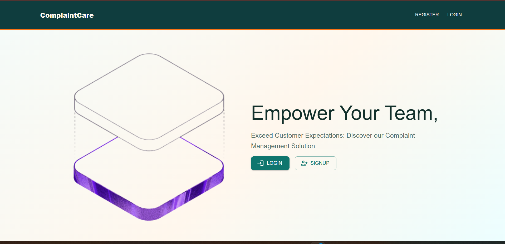
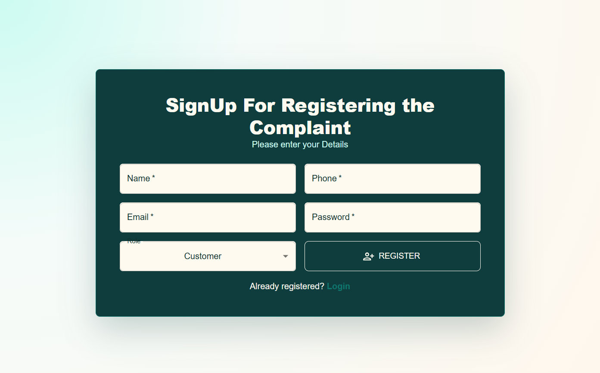
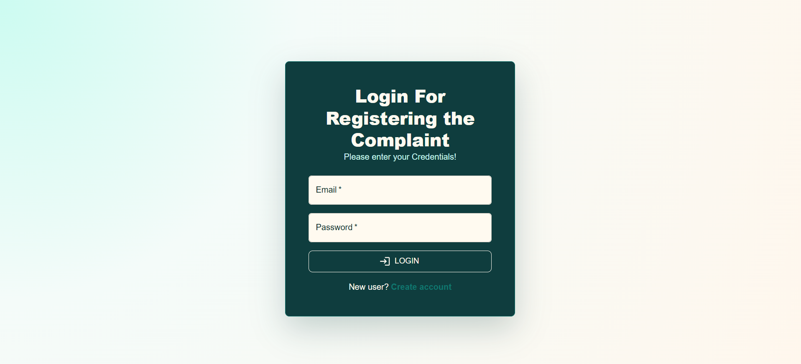
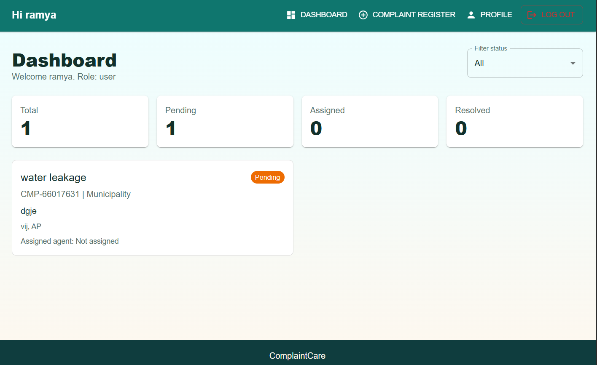
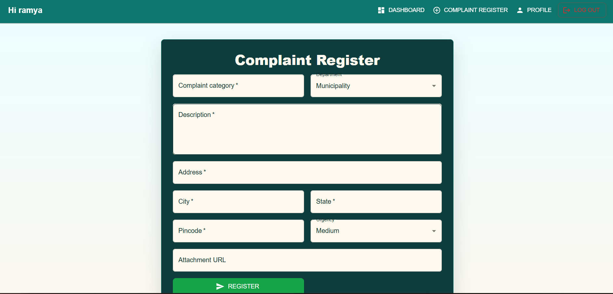
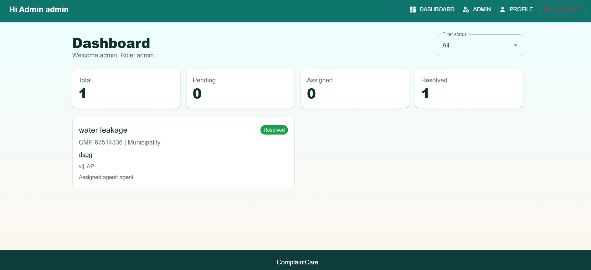
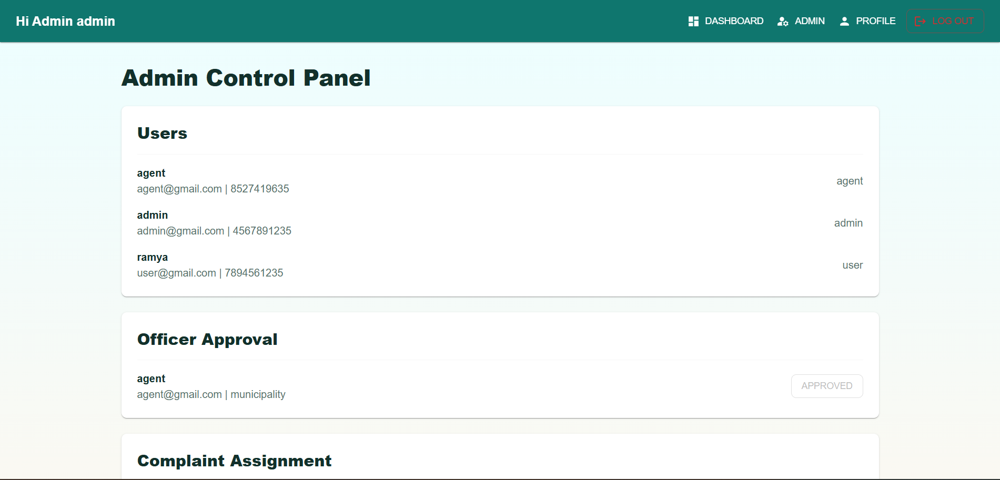
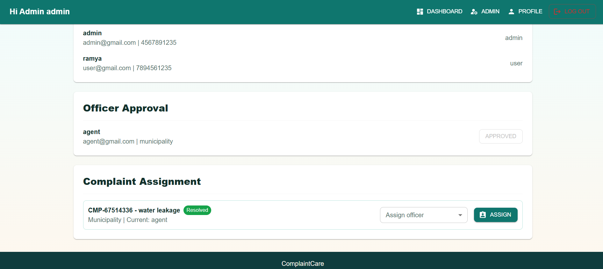
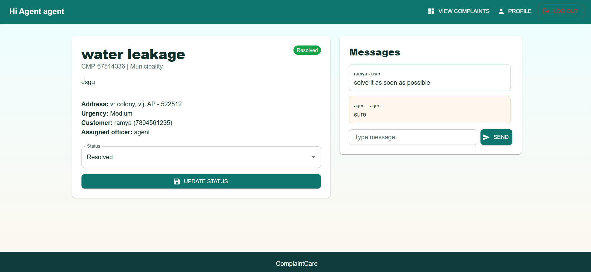

# Online Complaint Registration

Online Complaint Registration is a full-stack web application for registering, managing, assigning, and tracking complaints.

The project includes a React frontend, Node.js/Express backend, and MongoDB database.

## Demo Video

🎥 **Watch the project demo here:**

[Watch Demo Video](https://drive.google.com/file/d/16SELoijIrlrDEUjKOrP_OeIeeN03gKaI/view?usp=sharing)


## Screenshots

### Landing Page



### Register Page



### Login Page



### User Dashboard



### Complaint Register Page! 



### Admin Dashboard Page



### Admin Panel1



### Admin Panel2




### Officer Approval



## Features

- User registration and login
- Officer/agent registration with department
- Admin registration using admin code
- Complaint registration
- Complaint status tracking
- Complaint details page
- Message section for complaint communication
- Admin panel
- Officer approval by admin
- Complaint assignment to officers
- User profile management
- Secure authentication

## Tech Stack

### Frontend

- React
- Vite
- Material UI
- Axios
- React Router

### Backend

- Node.js
- Express.js
- MongoDB
- Mongoose
- JWT
- bcryptjs

## Project Structure

```text
online-complaint-registration
├── client
│   ├── src
│   │   ├── api
│   │   │   └── axios.js
│   │   ├── components
│   │   │   ├── ComplaintCard.jsx
│   │   │   ├── Layout.jsx
│   │   │   ├── ProtectedRoute.jsx
│   │   │   └── StatusChip.jsx
│   │   ├── context
│   │   │   └── AuthContext.jsx
│   │   ├── pages
│   │   │   ├── AdminPanel.jsx
│   │   │   ├── ComplaintDetails.jsx
│   │   │   ├── Dashboard.jsx
│   │   │   ├── Landing.jsx
│   │   │   ├── Login.jsx
│   │   │   ├── NewComplaint.jsx
│   │   │   ├── Profile.jsx
│   │   │   └── Register.jsx
│   │   ├── App.jsx
│   │   ├── main.jsx
│   │   └── styles.css
│   ├── index.html
│   ├── package.json
│   └── vite.config.js
│
├── server
│   ├── config
│   │   └── db.js
│   ├── controllers
│   │   ├── authController.js
│   │   ├── complaintController.js
│   │   ├── messageController.js
│   │   └── userController.js
│   ├── middleware
│   │   ├── authMiddleware.js
│   │   ├── errorHandler.js
│   │   └── securityMiddleware.js
│   ├── models
│   │   ├── Complaint.js
│   │   ├── Message.js
│   │   └── User.js
│   ├── routes
│   │   ├── authRoutes.js
│   │   ├── complaintRoutes.js
│   │   ├── messageRoutes.js
│   │   └── userRoutes.js
│   ├── utils
│   ├── .env.example
│   ├── index.js
│   └── package.json
│
├── screenshots
│   ├── landing.png
│   ├── register.png
│   ├── login.png
│   ├── user-dashboard.png
│   ├── complaint-register.png
│   ├── admin-dashboard.png
│   ├── admin-panel1.png
│   ├── admin-panel1.png
│   |__officer-approval.png
│
├── .gitignore
└── README.md
```


Admin registration code:

```text
change-this-admin-code
```

Install backend dependencies:

```bash
cd server
npm install
```

Install frontend dependencies:

```bash
cd ../client
npm install
```

## Run The Project

Start MongoDB first.

Run backend:

```bash
cd server
npm run dev
```

Open in browser:

```text
http://localhost:5***/
```

## User Roles

### User

- Register and login
- Submit complaints
- View complaint status
- Send messages in complaint details

### Officer / Agent

- Register with department
- Wait for admin approval
- View assigned complaints
- Update complaint status

### Admin

- Register using admin code
- Approve officers
- Assign complaints to officers
- Manage complaints and users

Thank You!